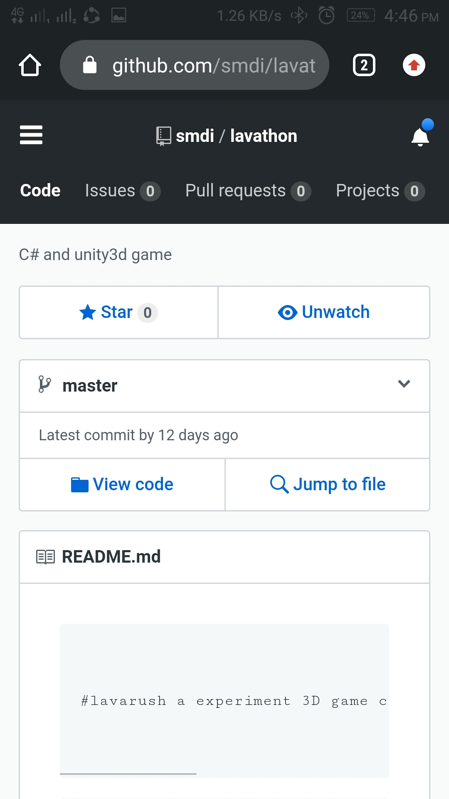

```


Contains about search bar you have to enter username


```


 


```


Show the profile of the user


```


 


```


Show the repositories of the user


```


 


```


Show the working  of the searchbar


```


 


```


when clicked opens in chrome


```


 


